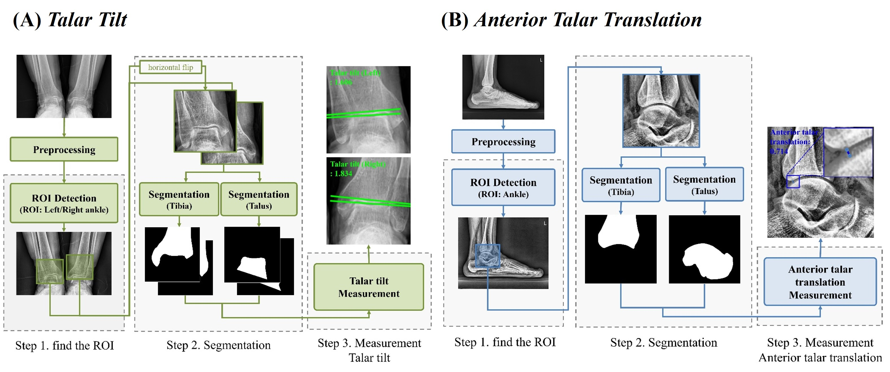

# 🩻Automated radiography assessment of ankle joint instability using deep learning

Official implementation of the paper:  
**"Automated radiography assessment of ankle joint instability using deep learning"**
Accepted at <i>Scientific Reports</i>, 2025
📄 [View the paper here](https://www.nature.com/articles/s41598-025-99620-6)

## Overview
We present a deep learning-based system for automatic measurement of talar tilt (TT) and anterior talar translation (ATT) on weight-bearing ankle radiographs. Trained on a dataset of over 4,000 patients, the system achieved high agreement with clinician assessments, demonstrating strong correlation and low error (e.g., TT: Pearson r = 0.798, MAE = 1.088°; ATT: r = 0.862, MAE = 0.468 mm). This approach offers a reliable, objective tool for evaluating ankle joint instability in clinical practice.
<p align="center">
  
</p>


---
### 📌 Note on Dataset Access
This project utilizes the <i>Ankle X-ray Dataset for Foot Disorders and Rehabilitation Assessment</i> provided by [AI-Hub](google.com/search?q=aihub+족부&sourceid=chrome&ie=UTF-8).<br>
While the dataset is publicly available, <b>access requires prior approval from an Institutional Review Board (IRB)</b> or an equivalent ethical oversight committee.
Please note that the dataset is <b>not distributed through this repository</b>, and all users must independently request access via the AI-Hub platform.

---
### 🚧 Project Checklist (Release Plan)

- <del>Dataset Usage Notice</del>
- Code Release
- Pretrained Model Release 
- Demo Page Open

---
## Citation
If you find our work useful in your research, please consider citing:
```bibtex 
@Article{Noh2025,
    author={Noh, Seungha and Lee, Mu Sook and Lee, Byoung-Dai},
    title={Automated radiography assessment of ankle joint instability using deep learning},
    journal={Scientific Reports},
    year={2025},
    volume={15},
    number={1},
    pages={15012},
    doi={10.1038/s41598-025-99620-6}}
```